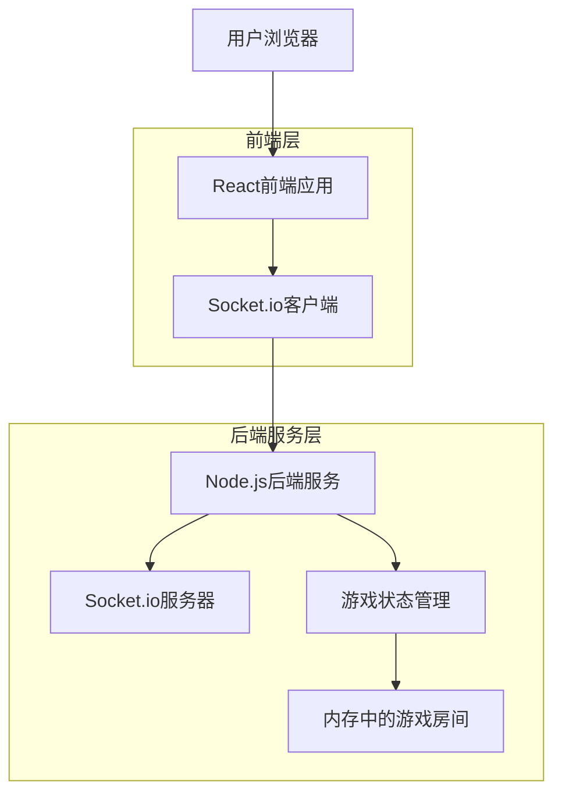
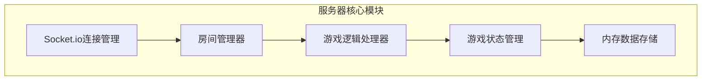

## 1. 架构设计



## 2. 技术描述

- **前端**: React@18 + TypeScript + TailwindCSS@3 + Vite
- **初始化工具**: vite-init
- **后端**: Node.js@18 + Express@4 + Socket.io@4 + TypeScript
- **实时通信**: Socket.io实现双向实时通信
- **状态管理**: 后端内存管理游戏状态，前端React状态管理UI

## 3. 路由定义

| 路由 | 用途 |
|-------|---------|
| / | 首页，游戏介绍和快速入口 |
| /lobby | 房间列表页，显示可加入的游戏房间 |
| /room/:roomId | 游戏房间页，具体的游戏界面 |
| /game-over | 结算页面，显示游戏结果 |

## 4. API定义

### 4.1 Socket.io事件定义

**客户端发送到服务器：**
```typescript
// 创建房间
interface CreateRoomRequest {
  playerName: string;
  maxPlayers: number; // 2-6
}

// 加入房间
interface JoinRoomRequest {
  roomId: string;
  playerName: string;
}

// 开始游戏
interface StartGameRequest {
  roomId: string;
}

// 叫分
interface BidRequest {
  roomId: string;
  playerId: string;
  bid: number; // 预测赢得的墩数
}

// 出牌
interface PlayCardRequest {
  roomId: string;
  playerId: string;
  card: Card;
}
```

**服务器发送到客户端：**
```typescript
// 房间状态更新
interface RoomStateUpdate {
  roomId: string;
  players: Player[];
  gameState: 'waiting' | 'bidding' | 'playing' | 'finished';
  currentRound: number;
  maxRounds: number;
}

// 游戏状态更新
interface GameStateUpdate {
  currentPlayerId: string;
  currentTrick: Card[];
  playerHands: { [playerId: string]: Card[] };
  bids: { [playerId: string]: number };
  tricksWon: { [playerId: string]: number };
  scores: { [playerId: string]: number };
}

// 聊天消息
interface ChatMessage {
  playerId: string;
  playerName: string;
  message: string;
  timestamp: number;
}
```

### 4.2 数据类型定义

```typescript
// 卡牌类型
interface Card {
  id: string;
  type: 'number' | 'pirate' | 'mermaid' | 'skull-king';
  value: number; // 数字牌的数值
  color?: 'red' | 'black' | 'yellow' | 'green'; // 数字牌的颜色
}

// 玩家信息
interface Player {
  id: string;
  name: string;
  socketId: string;
  isReady: boolean;
  isHost: boolean;
}

// 游戏房间
interface GameRoom {
  id: string;
  name: string;
  players: Player[];
  maxPlayers: number;
  gameState: 'waiting' | 'bidding' | 'playing' | 'finished';
  currentRound: number;
  deck: Card[];
  currentTrick: Card[];
  currentPlayerIndex: number;
  bids: { [playerId: string]: number };
  tricksWon: { [playerId: string]: number };
  scores: { [playerId: string]: number };
  chatMessages: ChatMessage[];
}
```

## 5. 服务器架构设计



### 5.1 核心模块职责

**房间管理器：**
- 创建和管理游戏房间
- 处理玩家加入/离开房间
- 维护房间状态和游戏配置

**游戏逻辑处理器：**
- 处理游戏开始、叫分、出牌等核心逻辑
- 判断牌型大小和赢家
- 计算得分和排名

**游戏状态管理：**
- 实时同步游戏状态给所有玩家
- 管理当前出牌玩家和轮次
- 处理游戏结束条件

## 6. 项目结构

```
skull-king-game/
├── client/                    # React前端
│   ├── src/
│   │   ├── components/        # React组件
│   │   ├── pages/            # 页面组件
│   │   ├── hooks/            # 自定义Hook
│   │   ├── services/         # API服务
│   │   ├── types/            # TypeScript类型定义
│   │   └── utils/            # 工具函数
│   ├── public/
│   └── package.json
├── server/                    # Node.js后端
│   ├── src/
│   │   ├── handlers/         # Socket事件处理器
│   │   ├── models/           # 数据模型
│   │   ├── services/         # 业务逻辑
│   │   ├── utils/            # 工具函数
│   │   └── types/            # TypeScript类型
│   └── package.json
├── shared/                    # 共享类型定义
│   └── types.ts
├── docker-compose.yml         # Docker部署配置
├── Dockerfile                 # 应用容器化配置
└── README.md                  # 项目说明文档
```

## 7. 部署方案

### 7.1 Docker化部署

**Dockerfile配置：**
```dockerfile
# 前端构建
FROM node:18-alpine as client-build
WORKDIR /app/client
COPY client/package*.json ./
RUN npm install
COPY client/ ./
RUN npm run build

# 后端构建
FROM node:18-alpine as server-build
WORKDIR /app/server
COPY server/package*.json ./
RUN npm install
COPY server/ ./
RUN npm run build

# 生产环境
FROM node:18-alpine
WORKDIR /app
COPY --from=server-build /app/server/dist ./server
COPY --from=server-build /app/server/node_modules ./server/node_modules
COPY --from=client-build /app/client/dist ./client/dist
COPY package.json ./
EXPOSE 3001
CMD ["node", "server/index.js"]
```

**docker-compose.yml配置：**
```yaml
version: '3.8'
services:
  skull-king:
    build: .
    ports:
      - "3001:3001"
    environment:
      - NODE_ENV=production
      - PORT=3001
    restart: unless-stopped
    networks:
      - game-network

networks:
  game-network:
    driver: bridge
```

### 7.2 云服务器部署步骤

1. **准备服务器环境**
   - 安装Docker和Docker Compose
   - 配置服务器防火墙（开放3001端口）

2. **部署应用**
   ```bash
   # 克隆项目代码
   git clone <your-repo-url>
   cd skull-king-game
   
   # 构建并启动应用
   docker-compose up -d --build
   
   # 查看运行状态
   docker-compose logs -f
   ```

3. **配置域名和HTTPS（可选）**
   - 使用Nginx作为反向代理
   - 配置SSL证书（Let's Encrypt）

4. **监控和维护**
   - 使用PM2或systemd管理服务
   - 设置日志轮转和备份策略
   - 监控服务器资源使用情况

### 7.3 推荐云服务商

**Render.com（推荐新手）：**
- 免费额度充足，适合测试
- 自动部署，配置简单
- 支持Docker部署

**Railway.app：**
- 按使用量计费
- 支持GitHub集成自动部署
- 提供数据库等附加服务

**VPS服务商（DigitalOcean, Linode）：**
- 完全控制服务器环境
- 成本较低但需要自行维护
- 适合有一定经验的开发者