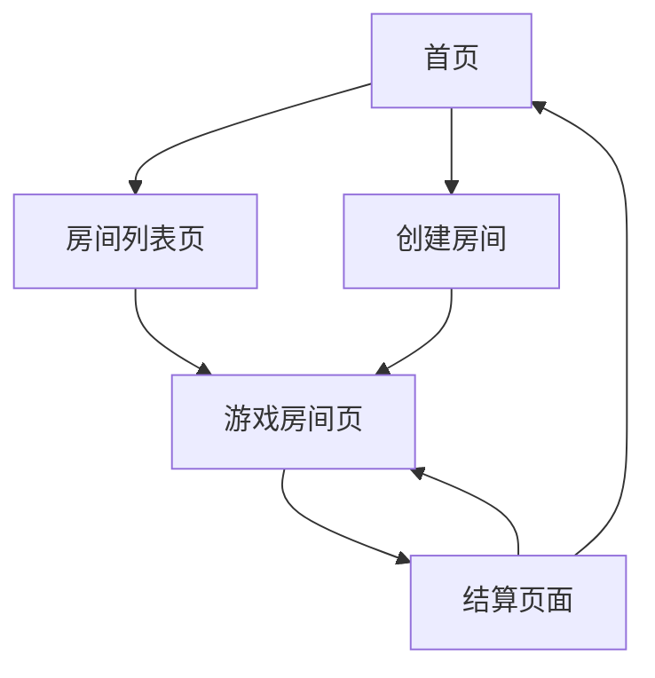

## 1. 产品概述
骷髅王桌游网页版是一个多人在线棋牌游戏，支持2-6名玩家同时在线对战。游戏基于经典骷髅王桌游规则，通过网页平台让玩家可以随时随地享受游戏乐趣。

目标用户：喜欢桌游、棋牌游戏的玩家群体，特别是喜欢策略类卡牌游戏的用户。

## 2. 核心功能

### 2.1 用户角色
| 角色 | 注册方式 | 核心权限 |
|------|----------|----------|
| 普通玩家 | 输入昵称即可进入游戏 | 创建房间、加入房间、进行游戏、查看排行榜 |
| 游客玩家 | 无需注册，系统自动分配昵称 | 加入房间、进行游戏 |

### 2.2 功能模块
骷髅王网页版包含以下主要页面：
1. **首页**：游戏介绍、快速开始、创建房间
2. **房间列表页**：显示可加入的游戏房间
3. **游戏房间页**：游戏主界面，包含牌桌、手牌、聊天等功能
4. **结算页面**：显示本局游戏结果和得分

### 2.3 页面详情
| 页面名称 | 模块名称 | 功能描述 |
|----------|----------|----------|
| 首页 | 游戏介绍 | 展示骷髅王游戏规则和特色 |
| 首页 | 快速开始 | 随机加入一个等待中的游戏房间 |
| 首页 | 创建房间 | 创建新的游戏房间，设置房间参数 |
| 房间列表页 | 房间列表 | 显示所有可加入的游戏房间，包含房间号、玩家数量、游戏状态 |
| 房间列表页 | 加入房间 | 输入房间号加入指定房间 |
| 游戏房间页 | 游戏主界面 | 显示当前游戏状态、玩家信息、出牌区域 |
| 游戏房间页 | 手牌区域 | 显示玩家当前手牌，支持选择出牌 |
| 游戏房间页 | 聊天功能 | 玩家间实时文字聊天 |
| 游戏房间页 | 叫分系统 | 每轮开始前玩家输入预测赢得的墩数 |
| 游戏房间页 | 出牌系统 | 轮流出牌，自动判断牌型大小 |
| 结算页面 | 得分显示 | 显示本局各玩家得分和排名 |
| 结算页面 | 继续游戏 | 开始下一局或返回房间列表 |

## 3. 核心流程

### 3.1 用户游戏流程
1. 玩家进入首页，可以选择快速开始或创建房间
2. 创建房间后等待其他玩家加入，或加入已有房间
3. 房间人数达到2-6人时，房主可以开始游戏
4. 游戏开始，系统发牌，玩家进行叫分
5. 按照轮次出牌，系统自动判断赢家
6. 10轮结束后显示最终得分和排名
7. 玩家可以选择继续游戏或退出房间

### 3.2 页面导航流程

## 4. 用户界面设计

### 4.1 设计风格
- **主色调**：深蓝色(#1e3a8a)搭配金色(#fbbf24)，营造神秘海盗主题
- **辅助色**：深灰色(#374151)和白色(#ffffff)用于文字和背景
- **按钮样式**：圆角矩形，悬停时有轻微阴影效果
- **字体**：无衬线字体，标题使用较大字号(24-32px)，正文14-16px
- **图标风格**：扁平化图标，使用海盗、骷髅、宝箱等主题元素

### 4.2 页面设计概述
| 页面名称 | 模块名称 | UI元素 |
|----------|----------|----------|
| 首页 | 游戏介绍 | 全屏背景图，中央展示游戏logo和简介文字 |
| 首页 | 操作按钮 | 醒目的快速开始和创建房间按钮，垂直排列 |
| 房间列表页 | 房间卡片 | 网格布局显示房间，每个房间显示房间号和玩家数 |
| 游戏房间页 | 牌桌区域 | 中央圆形牌桌，显示已出牌和当前墩数 |
| 游戏房间页 | 手牌区域 | 底部横向排列玩家手牌，支持点击选择 |
| 游戏房间页 | 玩家信息 | 顶部显示所有玩家头像、昵称和当前得分 |
| 结算页面 | 结果展示 | 排行榜形式显示玩家最终得分和胜负状态 |

### 4.3 响应式设计
- 采用桌面优先设计，主要面向电脑端用户
- 支持平板设备自适应，保持核心游戏体验
- 手机端可访问但优先推荐使用电脑进行游戏

## 5. 游戏规则说明

### 5.1 基础规则
- 使用66张特殊卡牌，包含数字牌、海盗牌、美人鱼牌和骷髅王牌
- 游戏共进行10轮，每轮玩家需要预测自己能赢得的墩数
- 每轮玩家轮流出牌，牌型最大者赢得该墩
- 预测正确的玩家获得加分，预测错误的玩家扣分

### 5.2 特殊卡牌
- **骷髅王**：最大牌，可击败任何其他牌
- **美人鱼**：可击败海盗牌，但被骷髅王击败
- **海盗牌**：可击败数字牌，但被美人鱼和骷髅王击败
- **数字牌**：按数字大小比较，同数字时先出牌者获胜